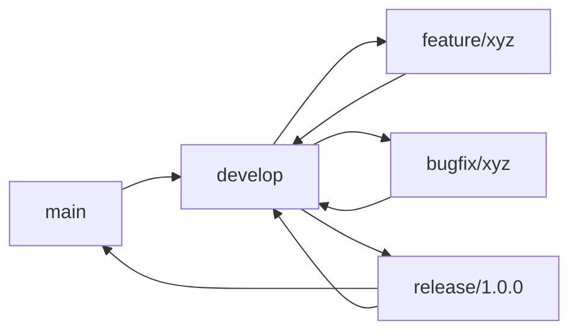

# Development Workflow

This document outlines the daily development practices, workflows, and guidelines for the General Web Scraper Frontend project.

## 🎯 Development Principles

### Core Values
- **Quality First**: Write clean, maintainable, and well-tested code
- **Collaboration**: Work together through code reviews and pair programming
- **Continuous Improvement**: Learn from feedback and iterate on solutions
- **User Focus**: Prioritize user experience and business value
- **Technical Excellence**: Maintain high standards for code quality and performance

### Development Philosophy
- **Agile Methodology**: Iterative development with regular feedback
- **Test-Driven Development**: Write tests first when appropriate
- **Code Review**: All changes must be reviewed by peers
- **Documentation**: Keep code and documentation in sync
- **Performance**: Consider performance implications of all changes

## 🔄 Daily Development Cycle

### Morning Routine
1. **Pull Latest Changes**: Update your local repository
2. **Review Notifications**: Check for code review requests and comments
3. **Plan Your Day**: Review tasks and set priorities
4. **Setup Environment**: Ensure development environment is ready

### Development Session
1. **Create Feature Branch**: Start new work in dedicated branches
2. **Implement Changes**: Write code following established patterns
3. **Test Locally**: Run tests and verify functionality
4. **Commit Changes**: Use descriptive commit messages
5. **Push and Create PR**: Submit work for review

### End of Day
1. **Update Progress**: Update task status and time tracking
2. **Clean Up**: Commit or stash any work in progress
3. **Plan Tomorrow**: Identify next steps and blockers
4. **Document Issues**: Note any problems or questions

## 🌿 Branching Strategy

### Branch Naming Convention
```
feature/description-of-feature
bugfix/description-of-bug
hotfix/critical-issue-description
refactor/description-of-refactoring
docs/description-of-documentation
```

### Branch Types

#### Feature Branches
- **Purpose**: New features and enhancements
- **Base**: `develop` branch
- **Naming**: `feature/feature-name`
- **Lifetime**: Until feature is complete and merged

#### Bug Fix Branches
- **Purpose**: Fix bugs and issues
- **Base**: `develop` branch (or `main` for critical fixes)
- **Naming**: `bugfix/bug-description`
- **Lifetime**: Until bug is fixed and merged

#### Hotfix Branches
- **Purpose**: Critical production fixes
- **Base**: `main` branch
- **Naming**: `hotfix/critical-issue`
- **Lifetime**: Until fix is deployed to production

#### Release Branches
- **Purpose**: Prepare releases and stabilize code
- **Base**: `develop` branch
- **Naming**: `release/version-number`
- **Lifetime**: Until release is complete

### Branch Workflow


## 📝 Commit Guidelines

### Commit Message Format
```
type(scope): description

[optional body]

[optional footer]
```

### Commit Types
- **feat**: New feature
- **fix**: Bug fix
- **docs**: Documentation changes
- **style**: Code style changes (formatting, etc.)
- **refactor**: Code refactoring
- **test**: Adding or updating tests
- **chore**: Build process or auxiliary tool changes

### Examples
```bash
# Feature commit
feat(jobs): add bulk delete functionality

# Bug fix commit
fix(auth): resolve login redirect issue

# Documentation commit
docs(api): update API endpoint documentation

# Style commit
style(components): format component files

# Refactor commit
refactor(store): simplify state management logic

# Test commit
test(utils): add tests for date formatting functions

# Chore commit
chore(deps): update dependencies to latest versions
```

### Commit Best Practices
- **One change per commit**: Keep commits focused and atomic
- **Descriptive messages**: Explain what and why, not how
- **Reference issues**: Link commits to related issues or tickets
- **Imperative mood**: Use present tense ("add" not "added")
- **Keep it short**: First line under 50 characters

## 🔍 Code Review Process

### Review Checklist
- [ ] **Functionality**: Does the code do what it's supposed to do?
- [ ] **Code Quality**: Is the code clean, readable, and maintainable?
- [ ] **Testing**: Are there appropriate tests for the changes?
- [ ] **Performance**: Are there any performance implications?
- [ ] **Security**: Are there any security concerns?
- [ ] **Accessibility**: Does the code meet accessibility standards?
- [ ] **Documentation**: Is the code properly documented?
- [ ] **Standards**: Does the code follow project conventions?

### Review Guidelines

#### For Reviewers
- **Be constructive**: Provide helpful, actionable feedback
- **Focus on code**: Review the code, not the person
- **Ask questions**: Clarify unclear implementations
- **Suggest alternatives**: Offer better approaches when possible
- **Be timely**: Respond to review requests promptly
- **Approve when ready**: Don't block on minor issues

#### For Authors
- **Be open to feedback**: Welcome suggestions and improvements
- **Respond to comments**: Address all review feedback
- **Ask for clarification**: Seek understanding of unclear feedback
- **Iterate quickly**: Make changes and request re-review
- **Thank reviewers**: Acknowledge helpful feedback

### Review Process
1. **Create Pull Request**: Include clear description and context
2. **Request Review**: Assign appropriate reviewers
3. **Address Feedback**: Make requested changes
4. **Re-request Review**: When changes are complete
5. **Merge**: After approval and CI checks pass

## 🧪 Testing Workflow

### Test-First Development
```typescript
// 1. Write failing test
describe('UserService', () => {
  it('should create user with valid data', () => {
    const userData = { name: 'John', email: 'john@example.com' };
    const result = createUser(userData);
    expect(result).toHaveProperty('id');
    expect(result.name).toBe('John');
  });
});

// 2. Write minimal implementation
const createUser = (userData: UserData) => {
  return { id: '1', ...userData };
};

// 3. Refactor and improve
const createUser = (userData: UserData): User => {
  const id = generateId();
  return { id, ...userData, createdAt: new Date() };
};
```

### Testing Strategy
- **Unit Tests**: Test individual functions and components
- **Integration Tests**: Test component interactions and API calls
- **E2E Tests**: Test complete user workflows
- **Performance Tests**: Test performance characteristics

### Test Coverage Requirements
- **Minimum Coverage**: 80% for statements, functions, and lines
- **Critical Paths**: 100% coverage for business logic
- **Edge Cases**: Test error conditions and boundary cases
- **User Interactions**: Test all user-facing functionality

## 🔧 Development Environment

### Local Setup
```bash
# Clone repository
git clone https://github.com/your-org/general-web-scraper-fe.git
cd general-web-scraper-fe

# Install dependencies
npm install

# Start development server
npm run dev

# Run tests
npm run test

# Run linting
npm run lint
```

### Environment Configuration
```bash
# Create local environment file
cp .env.example .env.local

# Configure environment variables
VITE_API_BASE_URL=http://localhost:8000
VITE_ENABLE_DEBUG_MODE=true
```

### Development Tools
- **VS Code**: Primary development environment
- **Chrome DevTools**: Browser debugging and profiling
- **React Developer Tools**: React component debugging
- **ESLint**: Code quality and style checking
- **Prettier**: Code formatting

## 📊 Code Quality Standards

### ESLint Configuration
```json
{
  "extends": [
    "@typescript-eslint/recommended",
    "plugin:react/recommended",
    "plugin:react-hooks/recommended",
    "plugin:jsx-a11y/recommended"
  ],
  "rules": {
    "@typescript-eslint/no-unused-vars": "error",
    "react-hooks/exhaustive-deps": "warn",
    "jsx-a11y/click-events-have-key-events": "error"
  }
}
```

### Prettier Configuration
```json
{
  "semi": true,
  "trailingComma": "es5",
  "singleQuote": true,
  "printWidth": 80,
  "tabWidth": 2
}
```

### TypeScript Configuration
```json
{
  "compilerOptions": {
    "strict": true,
    "target": "ES2022",
    "lib": ["ES2022", "DOM", "DOM.Iterable"],
    "noUnusedLocals": true,
    "noUnusedParameters": true
  }
}
```

## 🚀 Performance Guidelines

### React Performance
```typescript
// ✅ Good: Memoize expensive calculations
const expensiveValue = useMemo(() => {
  return heavyCalculation(data);
}, [data]);

// ✅ Good: Memoize callbacks
const handleClick = useCallback(() => {
  // handle click
}, [dependency]);

// ✅ Good: Memoize components
export const ExpensiveComponent = React.memo(({ data }) => {
  return <div>{/* render logic */}</div>;
});
```

### Bundle Optimization
```typescript
// ✅ Good: Dynamic imports for code splitting
const LazyComponent = lazy(() => import('./LazyComponent'));

// ✅ Good: Tree shaking friendly imports
import { Button } from '@/components/ui/Button';
// Instead of: import { Button } from '@/components/ui';
```

### Performance Monitoring
```typescript
// Performance measurement
const startTime = performance.now();
// ... perform operation
const endTime = performance.now();
console.log(`Operation took ${endTime - startTime} milliseconds`);

// Bundle size monitoring
npm run analyze
```

## 🔒 Security Guidelines

### Input Validation
```typescript
// ✅ Good: Validate user input
const validateEmail = (email: string): boolean => {
  const emailRegex = /^[^\s@]+@[^\s@]+\.[^\s@]+$/;
  return emailRegex.test(email);
};

// ✅ Good: Sanitize data before rendering
const sanitizeHtml = (html: string): string => {
  return DOMPurify.sanitize(html);
};
```

### API Security
```typescript
// ✅ Good: Use HTTPS
const API_BASE_URL = 'https://api.example.com';

// ✅ Good: Validate API responses
const validateApiResponse = (response: unknown): response is ApiResponse => {
  return (
    typeof response === 'object' &&
    response !== null &&
    'data' in response &&
    'status' in response
  );
};
```

## ♿ Accessibility Guidelines

### Semantic HTML
```typescript
// ✅ Good: Use semantic elements
<main>
  <section aria-labelledby="jobs-heading">
    <h2 id="jobs-heading">Available Jobs</h2>
    <ul role="list">
      {jobs.map(job => (
        <li key={job.id} role="listitem">
          {job.title}
        </li>
      ))}
    </ul>
  </section>
</main>
```

### ARIA Labels
```typescript
// ✅ Good: Proper ARIA labels
<button
  aria-label="Delete job"
  aria-describedby="delete-warning"
  onClick={handleDelete}
>
  <TrashIcon />
</button>
```

### Keyboard Navigation
```typescript
// ✅ Good: Keyboard event handling
const handleKeyDown = (event: React.KeyboardEvent) => {
  if (event.key === 'Enter' || event.key === ' ') {
    event.preventDefault();
    handleClick();
  }
};
```

## 📚 Documentation Standards

### Code Documentation
```typescript
/**
 * Fetches job details from the API
 * @param id - The unique identifier of the job
 * @param options - Optional configuration for the request
 * @returns Promise resolving to job details
 * @throws {NetworkError} When network request fails
 * @throws {ValidationError} When job ID is invalid
 */
const fetchJobDetails = async (
  id: string,
  options?: RequestOptions
): Promise<Job> => {
  // implementation
};
```

### Component Documentation
```markdown
# Button Component

A reusable button component with multiple variants and states.

## Props

| Prop | Type | Default | Description |
|------|------|---------|-------------|
| variant | 'primary' \| 'secondary' | 'primary' | Visual style variant |
| children | ReactNode | - | Content to display |

## Usage

```tsx
<Button variant="secondary" onClick={handleClick}>
  Click me
</Button>
```

## Examples

- Basic usage
- With custom styling
- Event handling
```

## 🔄 Continuous Integration

### Pre-commit Hooks
```json
{
  "husky": {
    "hooks": {
      "pre-commit": "lint-staged",
      "commit-msg": "commitlint -E HUSKY_GIT_PARAMS"
    }
  },
  "lint-staged": {
    "*.{ts,tsx}": [
      "eslint --fix",
      "prettier --write",
      "git add"
    ]
  }
}
```

### CI Pipeline
```yaml
# .github/workflows/ci.yml
name: CI
on: [push, pull_request]
jobs:
  test:
    runs-on: ubuntu-latest
    steps:
      - uses: actions/checkout@v4
      - uses: actions/setup-node@v4
      - run: npm ci
      - run: npm run lint
      - run: npm run type-check
      - run: npm run test:coverage
      - run: npm run build
```

## 🚨 Troubleshooting

### Common Issues

#### Build Failures
```bash
# Clear build cache
npm run clean

# Check for syntax errors
npm run lint

# Verify environment variables
npm run env:check
```

#### Test Failures
```bash
# Run tests with verbose output
npm run test -- --verbose

# Run specific test file
npm run test -- src/components/Button.test.tsx

# Check test coverage
npm run test:coverage
```

#### Dependency Issues
```bash
# Clear npm cache
npm cache clean --force

# Remove node_modules and reinstall
rm -rf node_modules package-lock.json
npm install

# Check for peer dependency conflicts
npm ls
```

## 📋 Daily Checklist

### Start of Day
- [ ] Pull latest changes from remote
- [ ] Check for code review requests
- [ ] Review daily tasks and priorities
- [ ] Ensure development environment is ready

### During Development
- [ ] Follow branching strategy
- [ ] Write tests for new functionality
- [ ] Follow coding standards and conventions
- [ ] Commit changes with descriptive messages
- [ ] Request code reviews when ready

### End of Day
- [ ] Update task progress
- [ ] Commit or stash work in progress
- [ ] Plan next steps for tomorrow
- [ ] Document any issues or questions
- [ ] Update time tracking

## 🎯 Best Practices Summary

### Code Quality
- Write clean, readable, and maintainable code
- Follow established patterns and conventions
- Write comprehensive tests for all functionality
- Use TypeScript for type safety
- Document complex logic and APIs

### Collaboration
- Participate actively in code reviews
- Provide constructive feedback to peers
- Ask questions when things are unclear
- Share knowledge and best practices
- Help onboard new team members

### Performance
- Consider performance implications of changes
- Optimize bundle size and loading times
- Monitor and measure performance metrics
- Use appropriate caching strategies
- Implement lazy loading where beneficial

### Security
- Validate and sanitize all user input
- Follow security best practices
- Keep dependencies updated
- Use HTTPS for all external communication
- Implement proper authentication and authorization

---

**Last Updated**: December 2024  
**Version**: 1.0.0  
**Maintainers**: Development Team
